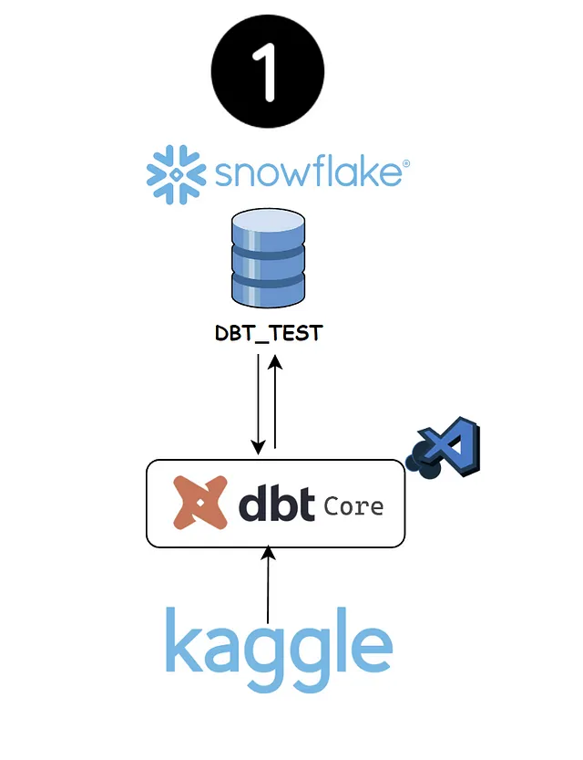
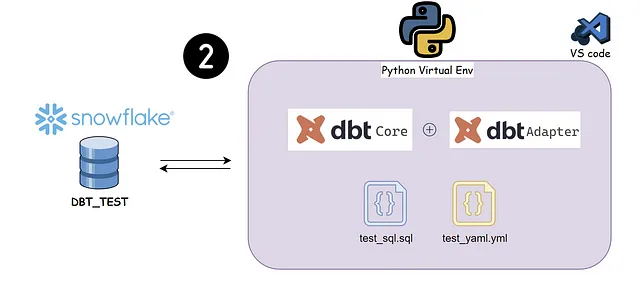
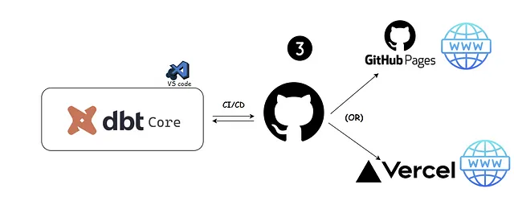
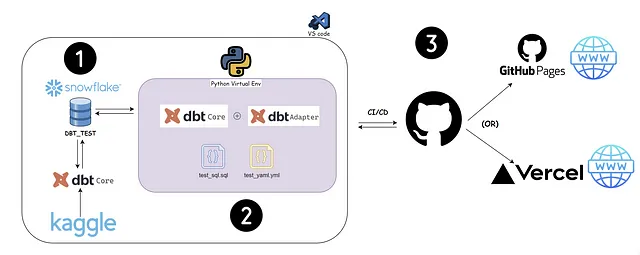

# Snowflakes❄ + DBT👨‍💻 Full Project🤯

This post will cover an end-to-end project where we will be using snowflakes and DBT.

- **Github link👨‍💻**: https://github.com/Ravikumar10593-hub/dbt-snowfalkes-project

## Problem Statement:

- **Snowflakes account set up and data push**: Set up a free Snowflakes account and use DBT to push the data from your local directory to the Snowflakes database

 
    <a href="https://medium.com/dev-genius/snowflakes-dbt-full-project-part-1-276526d12fe8">Full Article Read here</a>

- **Playing around with DBT core**: Use DBT to run and test all the .sql and .ymlfiles using Snowflakes as a data platform

 
    <a href="https://medium.com/@ravikumar10593/snowflakes-dbt-full-project-part-2-6f3390feefc1">Full Article Read here</a>

- **CICD and Deployment**: Push the entire code to Github and deploy the DBT document as a web page using Vercel or GitHub page (Link)

 
    <a href="https://medium.com/@ravikumar10593/snowflakes-dbt-full-project-part-3-584ba739dcb9">Full Article Read here</a>

## Solution Architecture

## Published version of DBT docs and DBT Elementary dashboard🕸:

- DBT docs: [Link](https://dbt-snowfalkes-project.vercel.app/#!/overview)
- DBT elementary dashboard: [Link](https://dbt-snowfalkes-project-elementary-report.vercel.app/#/report/dashboard)

